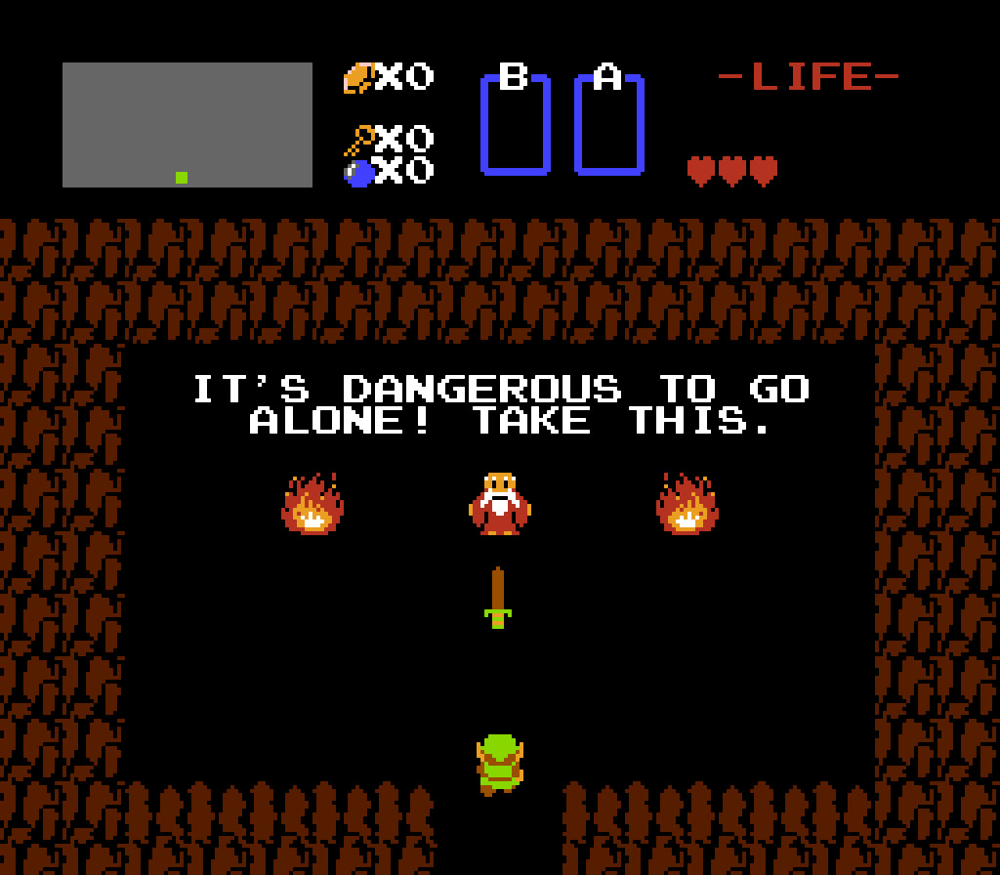
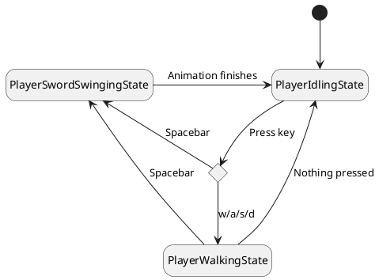
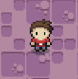
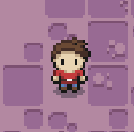
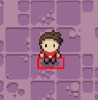
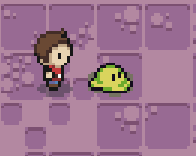
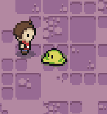
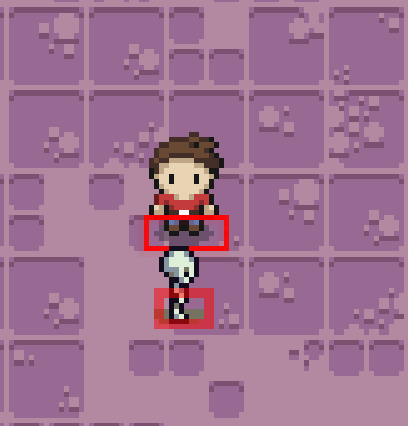
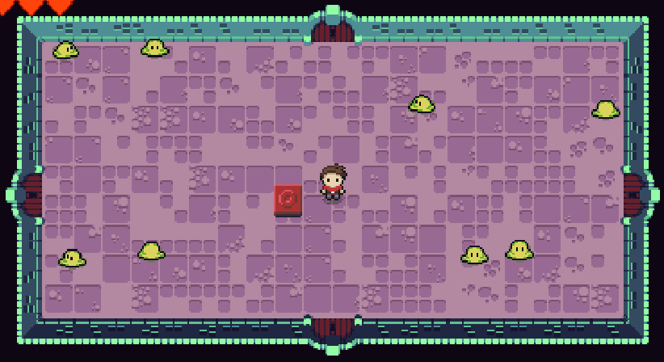

# ⚔️ Zelda

You can view the pretty version of the notes [here](https://jac-cs-game-programming-f23.github.io/Notes/#/4-Zelda/).

## 🎯 Objectives

- **Top-down Perspective**: With Flappy Bird and Mario, we were looking at the game world from the side. With Zelda, we'll have a bird's eye view of the world.
- **Infinite Dungeon Generation**: We've discussed previously the concept of games as illusions, and we'll be seeing another example of that today in Zelda, where we'll seemingly generate an endless dungeon.
- **Hitboxes**: Instead of using the entities "bounding box" (i.e. the rectangle drawn from `x, y, width, height`) to detect collisions, we'll use the concept of a hitbox, which is just another rectangle, to detect collisions instead. The result will be a more convincing illusion of depth and perspective.
- **Events**: Events are a way of broadcasting some message that informs us when something happens, and allows us to call a function in response.
- **Screen Scrolling**: We'll take a look at how we can use tweening to give the appearance of transitioning from room to room in our dungeon.

The Legend of Zelda is a top-down dungeon crawler where the player controls a sword and shield wielding character named Link. The games in this series generally all include elements of puzzles, action, adventure, and exploration. Over the course of the game, Link will acquire various items and upgrades that he can use to defeat enemies and solve puzzles. The first game in the series was released in 1986 on Nintendo's Famicom Disk System and was revolutionary for its time. It is widely considered to be one of the best game franchises to date.




_Image from [Breaking Canon](http://breakingcanon.com/the-legend-of-zelda/)_

## 🔨 Setup

1. Clone the repo (or download the zip) for today's lecture, which you can find [here](https://github.com/JAC-CS-Game-Programming-F23/5-Zelda).
2. Open the repo in Visual Studio Code.
3. Start Visual Studio Code's "Live Server" extension. If you don't have it installed:
   1. Click on the extensions icons in the left-hand side navigation.
   2. Search for "Live Server".
   3. Click install next to the extension by "Ritwick Dey". You may have to reload the window.

      

   4. Once it's installed, click "Go Live" on the bottom right of the window. This should start the server and automatically open a new tab in your browser at `http://127.0.0.1:5500/` (or whatever port it says on your machine).
      - The files the server serves will be relative to the directory you had open in VSC when you hit "Go Live".

## 🌅 Zelda-0 (The "Day-0" Update)

Zelda-0 generates and displays one room in the dungeon.

### Sprites

- We'll again need a sprite sheet in order to render our sprites to the screen. It's helpful for our sprites to be laid out in tile segments of 16x16 pixels, so that we can index into the sheet evenly in order to access particular sprites. However, we will inevitably encounter sprites that do not fit into our sprite sheet in this way, and these sprites will require slightly more complicated rendering logic.

### Top-Down Perspective

- A map in top-down perspective is essentially a tile map like we've seen before, but with the subtle difference of looking the map from up above rather than from the side.
- Some of the main visual differences might be that there's less of a focus on screen scrolling, and more of a focus on things like shadows on the walls, corners of the screen, lighting, and camera angles (you want your world to be slightly skewed rather than completely vertical, for example).

### Important Code

- `Room.js` is where everything for this update exists. The class starts with several constants that define the important measurements for the room.
- The constants prefixed with `TILE_` reference the sprites in the sheet located at `assets/images/tiles.png`.

  

  > Note that the tiles in the image above start at `1` whereas in the code they are indexed starting at `0`.

- `Sprite::generateSpritesFromSpriteSheet(spriteSheet, tileWidth, tileHeight)` is a new static method in our `Sprite` library class that assumes that every individual sprite in the specified `spriteSheet` is the exact same `tileWidth` and `tileHeight`. The sprites also must be laid out in a grid where the grid dimensions are `tileWidth` x `tileHeight`.
  - Obviously if the sheet provided does not meet these specifications, then more custom logic must be written on a case by case basis.

  ```javascript
  static generateSpritesFromSpriteSheet(spriteSheet, tileWidth, tileHeight) {
      const sprites = [];
      const sheetWidth = spriteSheet.width / tileWidth;
      const sheetHeight = spriteSheet.height / tileHeight;

      for (let y = 0; y < sheetHeight; y++) {
          for (let x = 0; x < sheetWidth; x++) {
              sprites.push(new Sprite(spriteSheet, x * tileWidth, y * tileHeight, tileWidth, tileHeight));
          }
      }

      return sprites;
  ```

- `Room::generateWallsAndFloors()` uses the constants defined at the top of the class and determines which sprites to use for the walls and floor. Since there are several potential tiles to use for a piece of wall or floor, we can have a slightly different look each time we create a new room.
- `Dungeon.js` right now is only a container that holds one room and renders it.
- `PlayState.js` instantiates a `Dungeon` and renders it.

## 🧝 Zelda-1 (The "Hero" Update)

Zelda-1 adds a hero character that the player can control. The hero can move around the room and also swing their sword.

### Sprites

- Sometimes the sprites in a sheet will not be neatly divided into even segments. For instance, our character sprite in Zelda is 20x16 pixels and also has several animations of different dimensions, such as his sword-swing animation (32x32 pixels).
- In order to render such a sprite properly to the screen, we have to associate an offset with that sprite's coordinates, such that the sprite is shifted by that offset on the screen when rendered.

### Hitboxes

- A hitboxes is an area that is defined for a sprite that designated where a collision is allowed to take place. Hitboxes are especially relevant in fighting scenarios.
- A hitbox would, upon collision with another sprite, register as a hit (e.g. the player deals damage to an enemy).
- In our Zelda game, you can imagine that the hero character would have a hitbox for where they can take damage and also another hitbox that defines where their sword can strike enemies.
- Open up `lib/Hitbox.js`. Notice that all a hitbox is is a position vector and dimensions vector. All we need for a hitbox is an x and y position and a width and height dimension.
  - This class can also be used to detect if another hitbox collided with it using `didCollide()`.
  - The hitbox can also be rendered to the screen for debugging purposes.

### State Diagram



### Important Code

- `src/entities/Player.js`: The hero character the player controls in the map. Has the ability to swing a sword to kill enemies and will collide into objects that are collidable.
  - In the constructor, we generate the sprites for both walking and sword swinging.
    - `positionOffset` is used to render the sprite at the correct location depending on the current state.
    - `swordHitbox` and `hitboxOffsets` are used to define the hitboxes that will be used to detect collisions.
- `src/entities/GameEntity.js`: Common properties and methods that all game entities will extend.
  - In `GameEntity::update()` note that we have to constantly update the hitbox such that it is always positioned relative to the entity.
- `src/states/entity/player/PlayerIdlingState.js`: In this state, the player is stationary unless a directional key or the spacebar is pressed.
- `src/states/entity/player/PlayerWalkingState.js`: In this state, the player can move around using the directional keys. From here, the player can go idle if no keys are being pressed. The player can also swing their sword if they press the spacebar.
- `src/states/entity/player/PlayerSwordSwingingState.js`: In this state, the player swings their sword out in front of them. This creates a temporary hitbox that enemies can potentially collide into.
  - Notice here that we're setting `positionOffset` so that the sprite is rendered correctly. If we didn't have this, then the hero would look like this when swinging the sword:

    

  - With the offset, we get the desired result:

    

  - Another important feature in this state is setting the sword's hitbox using `PlayerSwordSwingingState::setSwordHitbox()`. If we turn `DEBUG` to `true` in `globals.js`, then we'll be able to see what the hitbox area looks like:

    

## 😈 Zelda-2 (The "Enemies" Update)

Zelda-2 adds enemies into the room. The enemies can hurt the hero upon collision. The player can also kill the enemies by swinging their sword.

### Sprites

- Luckily, the sprite sheet for the enemies (`assets/images/enemies.png`) in our game follows the ideal layout of each sprite being 16x16 pixels. This enables us to use `Sprite.generateSpritesFromSpriteSheet()` just like with the tilemap and player sprites.


- We can do the same for `assets/images/hearts.png` which will be used in `src/services/UserInterface.js` to display the player's health at the top left of the screen.


### The Factory Design Pattern


_Image from [Refactoring Guru](https://refactoring.guru/design-patterns/factory-method)_

Recall that "design patterns" are battle-tested solutions for extremely common problems when developing software. The "problem" that we'll run into quickly when instantiating enemies is that the more enemies our game has, the more unruly it will get to instantiate them all. To tackle this issue, we'll put all code that instantiates new enemy classes inside of an `EnemyFactory` class.

For a quick primer into the factory pattern, [watch this video](https://www.youtube.com/watch?v=kuirGzhGhyw).

### Render Order

In "top-down" perspective games, it is important to consider the order of which we render the entities and objects in our world. If we don't consider this, then we get this undesirable effect:



To create the illusion of depth and perspective, we must render our entities and objects in a particular order such that **entities and objects lower on the screen are rendered after entities and objects higher up on the screen**.

To achieve this, we have to sort all the entities and objects on the screen by their bottom positions (i.e. y + height) which results in this desirable effect:



### Important Code

- `src/entities/Enemy.js`: The enemy characters in the game that randomly walk around the room and can damage the player.
  - There are two child classes of `Enemy`, namely `Slime` and `Skeleton`. The difference between these two classes are their sprites/animations as well as their movement speed. As you can imagine, there are infinite possibilities for how different types of enemies could behave.
  - Just like `Player`,`Enemy` also extends `GameEntity`.
- `src/entities/EnemyFactory.js`: Encapsulates all definitions for instantiating new enemies. Can generate an instance of an enemy specified by the enums in `EnemyType.js`.
- `Room::generateEntities()`: Uses the `EnemyFactory` to create all the enemies in the room.
- `Room::cleanUpEntities()`: Gets rid of all dead enemies so we don't have to keep track of them.
- `Room::buildRenderQueue()`:
  - Sorts the entities by their bottom positions. This will put them in an order such that entities higher on the screen will appear behind entities that are lower down. Since this game is in a "top-down" perspective, we need this effect to achieve a more convincing illusion of depth.
  - To do the actual sorting, we use [JavaScript's built-in `sort()` method](https://developer.mozilla.org/en-US/docs/Web/JavaScript/Reference/Global_Objects/Array/sort):

  ```javascript
  buildRenderQueue() {
      return this.entities.sort((a, b) => {
          let order = 0;
          const bottomA = a.hitbox.position.y + a.hitbox.dimensions.y;
          const bottomB = b.hitbox.position.y + b.hitbox.dimensions.y;

          if (a.renderPriority < b.renderPriority) {
              order = -1;
          }
          else if (a.renderPriority > b.renderPriority) {
              order = 1;
          }
          else if (bottomA < bottomB) {
              order = -1;
          }
          else {
              order = 1;
          }

          return order;
      });
  }
  ```

  - We've added a `GameEntity::renderPriority` field so that we can prioritize some entities over others regardless of their bottom position.
- `Room::updateEntities()`: Loops through all the entities and updates them respectively. This involves checking if any collisions happened between entity's hitboxes and applying the damage to the affected entities.
  - Note that we only detect collisions between hitboxes now instead of the entire "bounding box" of the entity.



- `Player::becomeInvulnerable()` & `Player::startInvulnerabilityTimer()`:
  - Usually in games like these, if the player takes a hit, they become invulnerable for a short period of time. The convention to show the player that the character is invulnerable is to make the character "flash".

  ```javascript
  startInvulnerabilityTimer() {
      const action = () => {
          this.alpha = this.alpha === 1 ? 0.5 : 1;
      };
      const interval = Player.INVULNERABLE_FLASH_INTERVAL;
      const duration = Player.INVULNERABLE_DURATION;
      const callback = () => {
          this.alpha = 1;
          this.isInvulnerable = false;
      };

      return timer.addTask(action, interval, duration, callback);
  }
  ```

## 🚪 Zelda-3 (The "Doors" Update)

Zelda-3 adds doors to the room. The doors can be opened by hitting a switch game object. In this implementation, we've hardcoded the doorway generation such that the doors will always be in the same position in every room, and they will always be locked until the switch is triggered. However, you can imagine that it might be nicer design to vary the doorway generation a bit, which is certainly the case in the real Zelda game.

## Sprites

The door sprites for this Zelda game are bigger than 16x16 pixels, so instead of rendering a single sprite from our sheet, we must instead render 4 sprites in order to properly display each door. This will change how we monitor for collisions as well, since we'll have to adjust each door's hitbox to cover all 4 sprites.

### Important Code

- `src/objects/Doorway.js`: One of four doors that appears on each side of a room.
  - These are simply instances of `GameObject` that, when collided with, the player can walk through this (open) door to go to an adjacent room.
  - For now, we'll only render the door and introduce the "walking through" mechanic in the next update.
- `src/objects/Switch.js`: Another game object that, when collided with, will open all of the doors. This is nearly identical to the `Block` game object from Mario.
  - We've set the `isSolid` property to true so that the player and enemies cannot overlap the switch. In `GameObject::onCollision()` we can check if the object is solid, and if so, set the collider's position relative to the object.
- `Room::generateObjects()`: Adds the switch and the doorways to an array that the room can reference.
- `Room::updateEntities()`: For each entity, check if it collided with any of the game objects and resolve the collision based on whatever object it happens to be. For a switch, all entities will bump into it but only the player can activate it.

  ```javascript
  // Room.js
  this.objects.forEach((object) => {
      if (object.didCollideWithEntity(entity.hitbox)) {
          if (object.isCollidable) {
              object.onCollision(entity);
          }
      }
  });

  // Switch.js
  onCollision(collider) {
      super.onCollision(collider);

      if (collider instanceof Player) {
          this.room.openDoors();
      }
  }
  ```

## 🗺️ Zelda-4 (The "Rooms" Update)

Zelda-4 enables the player to walk through the doors into (procedurally generated) adjacent rooms where they will be greeted by a new set of enemies.

### Dungeon Generation

- In games such as Zelda, dungeons are generally fixed. Meaning, they are preemptively created by the developers in some predetermined layout. In our version, we will be generating dungeons/rooms procedurally instead of preemptively.
- Here's what we want to do to simulate infinite transitioning from one room to another:
  1. Create a new room whenever the player collides with an open doorway.
  2. Render the new room off-screen with some offset depending on which direction the player is going, such that the new room is adjacent to the current room. This offset will be a negative or positive `CANVAS_WIDTH` or `CANVAS_HEIGHT` depending on the doorway direction.
  3. Tween from the coordinates of the current room to those of the new room, resetting the new room to have the coordinates of the current room `(0, 0)` once the tweening animation finishes.
  4. If the player collides with another open door, go back to step 1.
- If you wanted to do it the real "Zelda way", then the dungeons could be represented in a 2D array, such that some indexes are empty ("off") and others contain rooms ("on"), with each room connected to at least one other. To transition from room to room, display the new room by adding or subtracting 1 from the x or y index of the current room.
  - This allows the developer to "lock" doors and hide "keys" in certain rooms in the dungeon, such that the player has to visit each room in a particular order to beat the level.


_Image from [Zelda Dungeon](https://www.zeldadungeon.net/the-legend-of-zelda-walkthrough/level-1-the-eagle/#c2_2)_

### Events

We will be using the JavaScript `Event` API to have our doors signal to the dungeon that it is time to change rooms. In a nutshell, this is how we can create our own custom events:

```javascript
// Create the event.
const event = new Event('EventName');

// Listen for the event.
canvas.addEventListener('EventName', () => {
    /* The thing you want to do when the event happens... */
});

// Dispatch the event.
canvas.dispatchEvent(event);
```

[Read more about events here](https://developer.mozilla.org/en-US/docs/Web/Events/Creating_and_triggering_events)!

### Important Code

- `src/objects/Dungeon.js` now has many more properties and methods to facilitate the new feature of being able to move from room to room. There is a lot of new stuff happening in this class so please make sure to take a moment and understand everything that it is doing.
  - `currentRoom` and `nextRoom` are the rooms that the player can move between. The player starts in the `currentRoom` and after the panning animation has taken place, the player ends up in `nextRoom`, which then becomes the new `currentRoom`.
  - `camera` is not like the camera we implemented in Mario. In Zelda, the `camera` will be a JS object literal containing an `x` and `y` value. These values will be used to `translate()` the canvas during the panning animation:

  ```javascript
  context.translate(-Math.floor(this.camera.x), -Math.floor(this.camera.y));
  ```

  - We set up four event listeners to listen for room shift events. If one of these events is dispatched, then we call `beginShifting()`.
  - `beginShifting()` prepares the rooms, camera, and player to all be shifted. Once all the proper coordinates are set, we tween the camera in whichever direction the new room is in, as well as the player to be at the opposite door in the next room. For example, if the player went through the top door in `currentRoom`, then the player should appear at the bottom door in `nextRoom`.
  - `finishShifting()` is called once the tweens have been completed. It sets all of the values back to what they were originally before the shift, positions the player in the room, and closes the doors behind them! 😈
- `Room::adjacentOffset` is passed in when rendering all the tiles, entities, and objects to make them appear like they are shifting with the room while the tween is happening.

  ```javascript
  this.tiles.forEach((tileRow) => {
      tileRow.forEach((tile) => {
          tile.render(this.adjacentOffset);
      });
  });

  this.renderQueue.forEach((elementToRender) => {
      elementToRender.render(this.adjacentOffset);
  });
  ```

- `Doorway::update()`: To achieve the effect of the player walking underneath the arch of the door, we have to render the player before the door. Otherwise, we want the player to be above the door or else it will appear as if they are walking behind the door if they get too close.

  ```javascript
  update() {
      this.renderPriority = this.room.isShifting ? 1 : -1;
  }
  ```

- Since we have a game object that has an `update()` method now, we need to make sure we call this method from `Room`:

  ```javascript
  updateObjects(dt) {
      this.objects.forEach((object) => {
          object.update(dt);
      });
  }
  ```

And with all that, we finally get this beauty:



## ✨ Zelda-5 (The "Polish" Update)

Zelda-5 adds a title screen state as well as fade in/out transitions between states to give the game a more dramatic feel. We've also added a couple of music tracks and sound effects.

### Important Code

- `states/game/TitleScreenState.js`: Displays a title screen where the player can press enter to start a new game.
- `states/game/TransitionState.js`: An "intermediary" state whose sole job is to play a fade out/in animation.
  - Now, every state changes to the `TransitionState` and passes in the state they want to transition to.
  - The "transition animation" is tweening the opacity value of a black rectangle. Deceptively simple! 😇

And with that, we have a fully functioning game of Zelda!

## 🍺 NES Homebrew

One last thing if you're interested in this sort of development...

From [Wikipedia](https://en.wikipedia.org/wiki/Homebrew_(video_games)):

> Homebrew, when applied to video games, refers to games produced by hobbyists for proprietary video game consoles which are not intended to be user-programmable. Official documentation is often only available to licensed developers, and these systems may use storage formats that make distribution difficult (such as ROM cartridges or encrypted CD-ROMs). Many consoles have hardware restrictions to prevent unauthorized development.

Below are some links that you may find useful if curious to learn more:

- [NesDev Wiki](https://wiki.nesdev.org/w/index.php/Nesdev_Wiki)
- [NesDev Programming Guide](https://wiki.nesdev.org/w/index.php/Programming_guide)
- [NedDev Installing CC65](https://wiki.nesdev.org/w/index.php/Installing_CC65)

## 📚 References

- [Harvard's CS50 Introduction to Game Development - Zelda](https://cs50.harvard.edu/games/2018/notes/5/)
